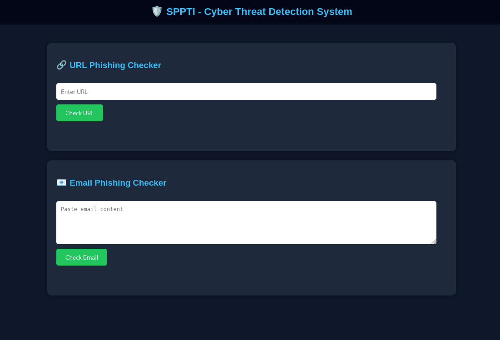

k# 🛡️ Smart Phishing Protection & Threat Intelligence System (SPPTI)

[](https://www.python.org/) 
[](https://flask.palletsprojects.com/)
[](https://developer.chrome.com/docs/extensions/)

---

# Smart Phishing Protection & Threat Intelligence System (SPPTI)

## 🔹 Overview
SPPTI is a cybersecurity-based web application that detects phishing URLs and emails using rule-based analysis and machine learning techniques. It provides real-time protection via a Chrome extension and stores scan history for threat intelligence.

---

## 🔹 Features
- URL phishing detection
- Email phishing detection
- Machine learning-based prediction
- Threat intelligence dashboard
- Scan history storage
- Browser extension for real-time detection

---

## 🔹 Technologies Used
- Python, Flask
- HTML, CSS, JavaScript
- SQLite
- Machine Learning (Scikit-learn)
- Chrome Extension API

---

## 🔹 Screenshots

### Extension Popup


### Dashboard & History
*(Add more screenshots here if you have them)*

---

## 🔹 How to Run

1. **Clone the repository:**
   ```bash
   git clone https://github.com/YourUsername/SPPTI.git
   cd SPPTI

